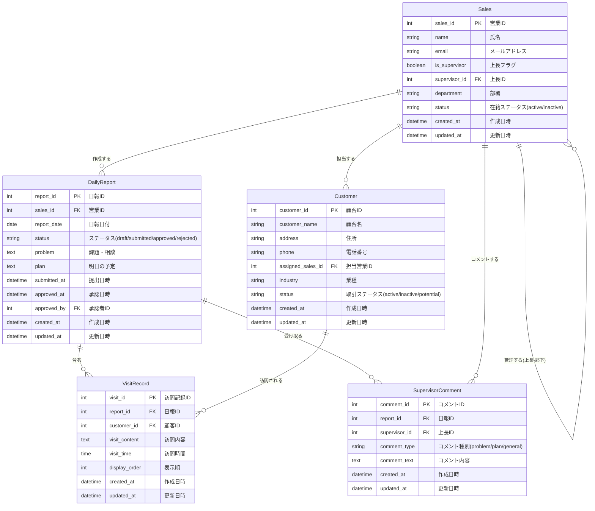

# 営業日報システム ER図

## ER図（Mermaid記法）



## エンティティ説明

### 1. Sales（営業マスタ）

営業担当者および上長の情報を管理するマスタテーブル。

**主要属性:**

- `sales_id`: 主キー、営業を一意に識別
- `is_supervisor`: 上長権限の有無を判定
- `supervisor_id`: 自分の上長を参照（自己参照）

**ビジネスルール:**

- 上長フラグがtrueの営業は、部下の日報を閲覧・承認可能
- supervisor_idがNULLの場合は最上位の管理者

### 2. Customer（顧客マスタ）

訪問先の顧客情報を管理するマスタテーブル。

**主要属性:**

- `customer_id`: 主キー、顧客を一意に識別
- `assigned_sales_id`: 担当営業を参照

**ビジネスルール:**

- 1顧客につき1人の担当営業が割り当てられる
- 複数の営業が同じ顧客を訪問することは可能（訪問記録で管理）

### 3. DailyReport（日報）

営業担当者が作成する日次の報告書。

**主要属性:**

- `report_id`: 主キー、日報を一意に識別
- `status`: 日報のライフサイクルを管理（下書き→提出済み→承認済み/差し戻し）
- `problem`: 今日の課題や相談事項
- `plan`: 明日やること
- `approved_by`: 承認した上長のID

**ビジネスルール:**

- 1営業1日1日報（report_dateとsales_idの組み合わせでユニーク制約）
- 提出後（status='submitted'）は編集不可
- 承認は上長のみ可能

### 4. VisitRecord（訪問記録）

日報に紐づく個別の顧客訪問記録。

**主要属性:**

- `visit_id`: 主キー、訪問記録を一意に識別
- `display_order`: 同一日報内での表示順序

**ビジネスルール:**

- 1日報に複数の訪問記録を登録可能
- 訪問記録は必ず日報に紐づく

### 5. SupervisorComment（上長コメント）

上長が日報に対して行うフィードバック。

**主要属性:**

- `comment_id`: 主キー、コメントを一意に識別
- `comment_type`: コメント対象（Problem/Plan/全体）
- `supervisor_id`: コメントした上長のID

**ビジネスルール:**

- 1日報に複数のコメントを追加可能
- コメントは上長のみ追加可能
- コメント後も日報は承認されるまで「提出済み」状態

## インデックス設計

### 推奨インデックス

```sql
-- 日報検索の高速化
CREATE INDEX idx_daily_report_sales_date ON DailyReport(sales_id, report_date);
CREATE INDEX idx_daily_report_status ON DailyReport(status);
CREATE INDEX idx_daily_report_date ON DailyReport(report_date);

-- 訪問記録検索の高速化
CREATE INDEX idx_visit_record_customer ON VisitRecord(customer_id);
CREATE INDEX idx_visit_record_report ON VisitRecord(report_id);

-- 上長-部下関係の検索
CREATE INDEX idx_sales_supervisor ON Sales(supervisor_id);

-- 顧客の担当営業検索
CREATE INDEX idx_customer_sales ON Customer(assigned_sales_id);

-- コメント検索
CREATE INDEX idx_comment_report ON SupervisorComment(report_id);
CREATE INDEX idx_comment_supervisor ON SupervisorComment(supervisor_id);
```

## 制約

### ユニーク制約

```sql
-- 1営業1日1日報
ALTER TABLE DailyReport ADD CONSTRAINT uk_sales_date UNIQUE (sales_id, report_date);

-- メールアドレスの重複防止
ALTER TABLE Sales ADD CONSTRAINT uk_sales_email UNIQUE (email);
```

### 外部キー制約

```sql
-- Sales
ALTER TABLE Sales ADD CONSTRAINT fk_sales_supervisor
    FOREIGN KEY (supervisor_id) REFERENCES Sales(sales_id);

-- Customer
ALTER TABLE Customer ADD CONSTRAINT fk_customer_sales
    FOREIGN KEY (assigned_sales_id) REFERENCES Sales(sales_id);

-- DailyReport
ALTER TABLE DailyReport ADD CONSTRAINT fk_daily_report_sales
    FOREIGN KEY (sales_id) REFERENCES Sales(sales_id);
ALTER TABLE DailyReport ADD CONSTRAINT fk_daily_report_approver
    FOREIGN KEY (approved_by) REFERENCES Sales(sales_id);

-- VisitRecord
ALTER TABLE VisitRecord ADD CONSTRAINT fk_visit_record_report
    FOREIGN KEY (report_id) REFERENCES DailyReport(report_id) ON DELETE CASCADE;
ALTER TABLE VisitRecord ADD CONSTRAINT fk_visit_record_customer
    FOREIGN KEY (customer_id) REFERENCES Customer(customer_id);

-- SupervisorComment
ALTER TABLE SupervisorComment ADD CONSTRAINT fk_comment_report
    FOREIGN KEY (report_id) REFERENCES DailyReport(report_id) ON DELETE CASCADE;
ALTER TABLE SupervisorComment ADD CONSTRAINT fk_comment_supervisor
    FOREIGN KEY (supervisor_id) REFERENCES Sales(sales_id);
```

## サンプルデータイメージ

### Sales（営業マスタ）

| sales_id | name     | email              | is_supervisor | supervisor_id | department |
| -------- | -------- | ------------------ | ------------- | ------------- | ---------- |
| 1        | 山田太郎 | yamada@example.com | true          | NULL          | 営業部     |
| 2        | 佐藤花子 | sato@example.com   | false         | 1             | 営業部     |
| 3        | 鈴木一郎 | suzuki@example.com | false         | 1             | 営業部     |

### Customer（顧客マスタ）

| customer_id | customer_name | assigned_sales_id | status |
| ----------- | ------------- | ----------------- | ------ |
| 1           | 株式会社ABC   | 2                 | active |
| 2           | 有限会社XYZ   | 3                 | active |

### DailyReport（日報）

| report_id | sales_id | report_date | status    | problem                    | plan                    |
| --------- | -------- | ----------- | --------- | -------------------------- | ----------------------- |
| 1         | 2        | 2026-02-21  | submitted | 新規顧客の開拓方法について | ABC社との契約条件の詰め |

### VisitRecord（訪問記録）

| visit_id | report_id | customer_id | visit_content                      | display_order |
| -------- | --------- | ----------- | ---------------------------------- | ------------- |
| 1        | 1         | 1           | 新商品の提案を実施。好感触を得た。 | 1             |

### SupervisorComment（上長コメント）

| comment_id | report_id | supervisor_id | comment_type | comment_text                           |
| ---------- | --------- | ------------- | ------------ | -------------------------------------- |
| 1          | 1         | 1             | problem      | 新規開拓は既存顧客からの紹介も有効です |
| 2          | 1         | 1             | plan         | 契約条件は事前に法務と相談してください |
