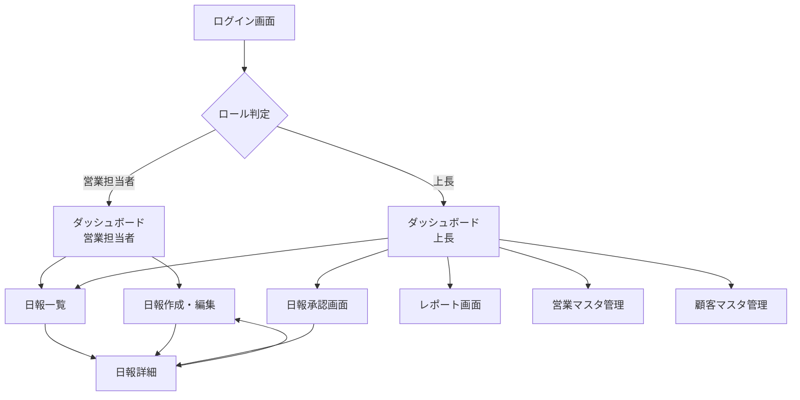

# 営業日報システム 画面定義書

## 目次

1. [画面遷移図](#画面遷移図)
2. [共通仕様](#共通仕様)
3. [ログイン画面](#1-ログイン画面)
4. [ダッシュボード（営業担当者）](#2-ダッシュボード営業担当者)
5. [ダッシュボード（上長）](#3-ダッシュボード上長)
6. [日報作成・編集画面](#4-日報作成編集画面)
7. [日報一覧画面](#5-日報一覧画面)
8. [日報詳細画面](#6-日報詳細画面)
9. [日報承認画面](#7-日報承認画面上長用)
10. [レポート画面](#8-レポート画面上長用)
11. [営業マスタ管理画面](#9-営業マスタ管理画面)
12. [顧客マスタ管理画面](#10-顧客マスタ管理画面)

---

## 画面遷移図



---

## 共通仕様

### ヘッダー

全画面共通で表示されるヘッダー（ログイン後）

```
┌─────────────────────────────────────────────────────────────┐
│ 📊 営業日報システム              👤 山田太郎 ▼ │ ログアウト │
├─────────────────────────────────────────────────────────────┤
│ [ダッシュボード] [日報作成] [日報一覧] [レポート] [マスタ管理] │
└─────────────────────────────────────────────────────────────┘
```

**要素:**

- システム名
- ログインユーザー名
- ユーザーメニュー（プロフィール、設定、ログアウト）
- メインナビゲーション（ロールに応じて表示項目を制御）

### レスポンシブデザイン

- **PC**: 横並びレイアウト、サイドバーナビゲーション
- **タブレット**: 2カラムレイアウト、ドロワーメニュー
- **スマートフォン**: 1カラムレイアウト、ハンバーガーメニュー

### エラー表示

- 入力エラー: フィールド下に赤文字で表示
- システムエラー: トースト通知またはモーダルダイアログ
- 成功メッセージ: 緑色のトースト通知

---

## 1. ログイン画面

### 画面概要

ユーザー認証を行う初期画面。

### レイアウト

```
┌─────────────────────────────────────┐
│                                     │
│        営業日報システム              │
│                                     │
│     ┌─────────────────────┐        │
│     │  メールアドレス        │        │
│     │  ___________________  │        │
│     └─────────────────────┘        │
│                                     │
│     ┌─────────────────────┐        │
│     │  パスワード            │        │
│     │  ___________________  │        │
│     └─────────────────────┘        │
│                                     │
│     ☑ ログイン状態を保持する        │
│                                     │
│          [ログイン]                 │
│                                     │
│     パスワードを忘れた方はこちら     │
│                                     │
└─────────────────────────────────────┘
```

### 入力項目

| 項目名             | 入力タイプ | 必須 | バリデーション          |
| ------------------ | ---------- | ---- | ----------------------- |
| メールアドレス     | text/email | ○    | メール形式、最大255文字 |
| パスワード         | password   | ○    | 最小8文字               |
| ログイン状態を保持 | checkbox   | -    | -                       |

### ボタン・アクション

| ボタン名             | アクション               | 遷移先                     |
| -------------------- | ------------------------ | -------------------------- |
| ログイン             | 認証処理を実行           | ダッシュボード（ロール別） |
| パスワードを忘れた方 | パスワードリセット画面へ | パスワードリセット画面     |

### バリデーション

- メールアドレス未入力: "メールアドレスを入力してください"
- パスワード未入力: "パスワードを入力してください"
- 認証失敗: "メールアドレスまたはパスワードが正しくありません"

---

## 2. ダッシュボード（営業担当者）

### 画面概要

営業担当者のホーム画面。日報の作成状況や上長コメントを確認できる。

### レイアウト

```
┌─────────────────────────────────────────────────────────────┐
│ ダッシュボード                              2026年2月21日（金） │
├─────────────────────────────────────────────────────────────┤
│                                                             │
│ ┌─────────────────────┐  ┌─────────────────────┐          │
│ │ 📝 本日の日報        │  │ 💬 未読コメント      │          │
│ │                     │  │                     │          │
│ │  ステータス: 下書き  │  │  3件の新着コメント   │          │
│ │                     │  │                     │          │
│ │  [作成を続ける]      │  │  [確認する]         │          │
│ └─────────────────────┘  └─────────────────────┘          │
│                                                             │
│ ┌───────────────────────────────────────────┐              │
│ │ 📅 今週の活動サマリー                      │              │
│ │                                           │              │
│ │  訪問件数: 12件                            │              │
│ │  提出済み日報: 4/5日                       │              │
│ │                                           │              │
│ │  [詳細を見る]                              │              │
│ └───────────────────────────────────────────┘              │
│                                                             │
│ ┌───────────────────────────────────────────┐              │
│ │ 📋 最近の日報                              │              │
│ │                                           │              │
│ │  2/20 (木) | 承認済み | 訪問3件            │ [詳細]      │
│ │  2/19 (水) | 承認済み | 訪問2件            │ [詳細]      │
│ │  2/18 (火) | 提出済み | 訪問4件            │ [詳細]      │
│ │                                           │              │
│ │  [すべて見る]                              │              │
│ └───────────────────────────────────────────┘              │
│                                                             │
└─────────────────────────────────────────────────────────────┘
```

### カード表示項目

#### 本日の日報カード

- 日報のステータス（未作成 / 下書き / 提出済み / 承認済み）
- アクションボタン（新規作成 / 作成を続ける / 詳細を見る）

#### 未読コメントカード

- 未読コメント件数
- 確認アクション

#### 今週の活動サマリー

- 訪問件数
- 提出済み日報数
- グラフ表示（オプション）

#### 最近の日報リスト

- 日付、ステータス、訪問件数
- 詳細リンク

---

## 3. ダッシュボード（上長）

### 画面概要

上長用のホーム画面。部下の日報承認状況やチームの活動を確認できる。

### レイアウト

```
┌─────────────────────────────────────────────────────────────┐
│ ダッシュボード（上長）                      2026年2月21日（金） │
├─────────────────────────────────────────────────────────────┤
│                                                             │
│ ┌─────────────────────┐  ┌─────────────────────┐          │
│ │ ⏰ 未承認の日報      │  │ 📊 チームサマリー    │          │
│ │                     │  │                     │          │
│ │  5件の未承認日報     │  │  今週の訪問件数      │          │
│ │                     │  │  45件               │          │
│ │  [確認する]         │  │                     │          │
│ └─────────────────────┘  └─────────────────────┘          │
│                                                             │
│ ┌───────────────────────────────────────────┐              │
│ │ 👥 部下の提出状況（今週）                  │              │
│ │                                           │              │
│ │  佐藤花子  ■■■■□  4/5日  [日報一覧]     │              │
│ │  鈴木一郎  ■■■■■  5/5日  [日報一覧]     │              │
│ │  田中次郎  ■■■□□  3/5日  [日報一覧]     │              │
│ │                                           │              │
│ └───────────────────────────────────────────┘              │
│                                                             │
│ ┌───────────────────────────────────────────┐              │
│ │ 🔔 最近のアクティビティ                    │              │
│ │                                           │              │
│ │  15:30 佐藤花子が日報を提出しました         │              │
│ │  14:20 鈴木一郎が日報を提出しました         │              │
│ │  13:45 田中次郎の日報を承認しました         │              │
│ │                                           │              │
│ └───────────────────────────────────────────┘              │
│                                                             │
└─────────────────────────────────────────────────────────────┘
```

### カード表示項目

#### 未承認の日報カード

- 未承認の日報件数
- 承認画面へのリンク

#### チームサマリーカード

- 今週の訪問件数合計
- 提出率
- その他KPI

#### 部下の提出状況

- 部下名
- 提出状況（視覚的プログレスバー）
- 提出日数 / 営業日数
- 個別日報一覧へのリンク

#### 最近のアクティビティ

- タイムライン形式で最近の活動を表示

---

## 4. 日報作成・編集画面

### 画面概要

営業担当者が日報を作成・編集する画面。

### レイアウト

```
┌─────────────────────────────────────────────────────────────┐
│ 日報作成                                   [下書き保存] [提出] │
├─────────────────────────────────────────────────────────────┤
│                                                             │
│ 基本情報                                                     │
│ ┌─────────────────────────────────────────┐                │
│ │ 日付: [2026-02-21▼]  ステータス: 下書き  │                │
│ └─────────────────────────────────────────┘                │
│                                                             │
│ 訪問記録                                         [+ 追加]    │
│ ┌─────────────────────────────────────────┐                │
│ │ 訪問1                                  [×]│                │
│ │                                           │                │
│ │ 顧客: [株式会社ABC ▼]                      │                │
│ │                                           │                │
│ │ 訪問時間: [14:00]（オプション）             │                │
│ │                                           │                │
│ │ 訪問内容:                                  │                │
│ │ ┌───────────────────────────────────┐    │                │
│ │ │ 新商品の提案を実施。                │    │                │
│ │ │ 好感触を得た。                      │    │                │
│ │ └───────────────────────────────────┘    │                │
│ └─────────────────────────────────────────┘                │
│                                                             │
│ ┌─────────────────────────────────────────┐                │
│ │ 訪問2                                  [×]│                │
│ │                                           │                │
│ │ 顧客: [有限会社XYZ ▼]                      │                │
│ │ 訪問時間: [16:30]                          │                │
│ │ 訪問内容:                                  │                │
│ │ ┌───────────────────────────────────┐    │                │
│ │ │ 既存契約の更新について打ち合わせ    │    │                │
│ │ └───────────────────────────────────┘    │                │
│ └─────────────────────────────────────────┘                │
│                                                             │
│ Problem（今日の課題・相談）                                  │
│ ┌───────────────────────────────────────────┐              │
│ │ 新規顧客の開拓方法について                 │              │
│ │                                           │              │
│ └───────────────────────────────────────────┘              │
│                                                             │
│ Plan（明日の予定）                                           │
│ ┌───────────────────────────────────────────┐              │
│ │ ABC社との契約条件の詰め                    │              │
│ │ XYZ社への見積書提出                        │              │
│ │                                           │              │
│ └───────────────────────────────────────────┘              │
│                                                             │
│                               [下書き保存] [キャンセル] [提出] │
└─────────────────────────────────────────────────────────────┘
```

### 入力項目

#### 基本情報

| 項目名 | 入力タイプ | 必須 | バリデーション |
| ------ | ---------- | ---- | -------------- |
| 日付   | date       | ○    | 未来日は不可   |

#### 訪問記録（繰り返し）

| 項目名   | 入力タイプ | 必須 | バリデーション     |
| -------- | ---------- | ---- | ------------------ |
| 顧客     | select     | ○    | 顧客マスタから選択 |
| 訪問時間 | time       | -    | HH:MM形式          |
| 訪問内容 | textarea   | ○    | 最大1000文字       |

#### Problem / Plan

| 項目名  | 入力タイプ | 必須 | バリデーション |
| ------- | ---------- | ---- | -------------- |
| Problem | textarea   | -    | 最大500文字    |
| Plan    | textarea   | -    | 最大500文字    |

### ボタン・アクション

| ボタン名       | アクション                | 条件               |
| -------------- | ------------------------- | ------------------ |
| 訪問記録を追加 | 訪問記録入力欄を追加      | -                  |
| 訪問記録を削除 | 該当の訪問記録を削除      | -                  |
| 下書き保存     | ステータス=下書きで保存   | -                  |
| 提出           | ステータス=提出済みで保存 | 訪問記録が1件以上  |
| キャンセル     | 編集を破棄して前画面へ    | 確認ダイアログ表示 |

### バリデーション

- 日付未選択: "日付を選択してください"
- 訪問記録0件で提出: "訪問記録を1件以上入力してください"
- 顧客未選択: "顧客を選択してください"
- 訪問内容未入力: "訪問内容を入力してください"
- 訪問内容文字数超過: "訪問内容は1000文字以内で入力してください"

### 特記事項

- 下書き状態では何度でも編集可能
- 提出後は編集不可（上長が差し戻した場合のみ再編集可能）
- 訪問記録はドラッグ&ドロップで順序変更可能

---

## 5. 日報一覧画面

### 画面概要

過去の日報を検索・閲覧する画面。

### レイアウト

```
┌─────────────────────────────────────────────────────────────┐
│ 日報一覧                                      [+ 新規作成]    │
├─────────────────────────────────────────────────────────────┤
│                                                             │
│ 検索条件                                                     │
│ ┌─────────────────────────────────────────┐                │
│ │ 期間: [2026-02-01] ～ [2026-02-21]       │                │
│ │ ステータス: [すべて▼]                     │                │
│ │ 顧客: [すべて▼]                           │  [検索] [クリア]│
│ └─────────────────────────────────────────┘                │
│                                                             │
│ 検索結果: 15件                                               │
│                                                             │
│ ┌─────────────────────────────────────────────────────┐    │
│ │ 日付   │ ステータス │ 訪問件数 │ 上長コメント │ 操作  │    │
│ ├─────────────────────────────────────────────────────┤    │
│ │ 2/21 (金) │ 下書き   │ 2件     │ -           │ [編集] │    │
│ │ 2/20 (木) │ 承認済み │ 3件     │ 2件         │ [詳細] │    │
│ │ 2/19 (水) │ 承認済み │ 2件     │ 1件         │ [詳細] │    │
│ │ 2/18 (火) │ 提出済み │ 4件     │ -           │ [詳細] │    │
│ │ 2/17 (月) │ 承認済み │ 3件     │ 3件         │ [詳細] │    │
│ │ ...                                                      │    │
│ └─────────────────────────────────────────────────────┘    │
│                                                             │
│                                    ◀ 1 2 3 4 5 ▶            │
│                                                             │
└─────────────────────────────────────────────────────────────┘
```

### 検索条件

| 項目名       | 入力タイプ | デフォルト値 |
| ------------ | ---------- | ------------ |
| 期間（開始） | date       | 1ヶ月前      |
| 期間（終了） | date       | 本日         |
| ステータス   | select     | すべて       |
| 顧客         | select     | すべて       |

### 一覧表示項目

| 項目名       | 説明                                    |
| ------------ | --------------------------------------- |
| 日付         | 日報の日付                              |
| ステータス   | 下書き / 提出済み / 承認済み / 差し戻し |
| 訪問件数     | 訪問記録の件数                          |
| 上長コメント | コメント件数                            |
| 操作         | 編集 / 詳細ボタン                       |

### ボタン・アクション

| ボタン名 | アクション         | 遷移先                     |
| -------- | ------------------ | -------------------------- |
| 新規作成 | 新規日報作成       | 日報作成画面               |
| 検索     | 検索条件で絞り込み | -                          |
| クリア   | 検索条件をクリア   | -                          |
| 編集     | 日報を編集         | 日報編集画面（下書きのみ） |
| 詳細     | 日報詳細を表示     | 日報詳細画面               |

### ページネーション

- 1ページ20件表示
- ページ番号による移動
- 前へ / 次へ ボタン

---

## 6. 日報詳細画面

### 画面概要

日報の詳細を表示し、上長コメントを確認できる画面。

### レイアウト

```
┌─────────────────────────────────────────────────────────────┐
│ 日報詳細                                    [一覧に戻る] [編集] │
├─────────────────────────────────────────────────────────────┤
│                                                             │
│ 基本情報                                                     │
│ ┌─────────────────────────────────────────┐                │
│ │ 日付: 2026年2月21日（金）                  │                │
│ │ 営業: 佐藤花子                             │                │
│ │ ステータス: 承認済み ✓                     │                │
│ │ 承認者: 山田太郎（2026-02-22 09:30）       │                │
│ └─────────────────────────────────────────┘                │
│                                                             │
│ 訪問記録                                                     │
│ ┌─────────────────────────────────────────┐                │
│ │ 📍 訪問1: 株式会社ABC                      │                │
│ │    訪問時間: 14:00                         │                │
│ │                                           │                │
│ │    新商品の提案を実施。                    │                │
│ │    好感触を得た。次回具体的な見積もりを    │                │
│ │    提示する予定。                          │                │
│ └─────────────────────────────────────────┘                │
│                                                             │
│ ┌─────────────────────────────────────────┐                │
│ │ 📍 訪問2: 有限会社XYZ                      │                │
│ │    訪問時間: 16:30                         │                │
│ │                                           │                │
│ │    既存契約の更新について打ち合わせ。      │                │
│ │    条件面で合意。来週契約書を持参。        │                │
│ └─────────────────────────────────────────┘                │
│                                                             │
│ Problem（今日の課題・相談）                                  │
│ ┌─────────────────────────────────────────┐                │
│ │ 新規顧客の開拓方法について                 │                │
│ │                                           │                │
│ │ 💬 上長コメント（山田太郎 2026-02-22 09:30）│                │
│ │    新規開拓は既存顧客からの紹介も有効です。│                │
│ │    来週のミーティングで戦略を相談しましょう│                │
│ └─────────────────────────────────────────┘                │
│                                                             │
│ Plan（明日の予定）                                           │
│ ┌─────────────────────────────────────────┐                │
│ │ ABC社との契約条件の詰め                    │                │
│ │ XYZ社への契約書持参                        │                │
│ │                                           │                │
│ │ 💬 上長コメント（山田太郎 2026-02-22 09:30）│                │
│ │    契約条件は事前に法務と相談してください  │                │
│ └─────────────────────────────────────────┘                │
│                                                             │
│ 全体コメント                                                 │
│ ┌─────────────────────────────────────────┐                │
│ │ 💬 山田太郎（2026-02-22 09:30）            │                │
│ │    今日も良い活動ができていますね。        │                │
│ │    引き続き頑張ってください。              │                │
│ └─────────────────────────────────────────┘                │
│                                                             │
└─────────────────────────────────────────────────────────────┘
```

### 表示項目

#### 基本情報

- 日付
- 営業担当者名
- ステータス
- 承認者・承認日時（承認済みの場合）

#### 訪問記録

- 顧客名
- 訪問時間
- 訪問内容

#### Problem / Plan

- 内容
- 上長コメント（コメント者、日時）

#### 全体コメント

- コメント者
- コメント日時
- コメント内容

### ボタン・アクション

| ボタン名   | アクション     | 条件                  |
| ---------- | -------------- | --------------------- |
| 一覧に戻る | 日報一覧へ戻る | -                     |
| 編集       | 日報編集画面へ | ステータス=下書きのみ |

---

## 7. 日報承認画面（上長用）

### 画面概要

上長が部下の日報を確認し、コメント・承認を行う画面。

### レイアウト

```
┌─────────────────────────────────────────────────────────────┐
│ 日報承認                                          [一覧に戻る] │
├─────────────────────────────────────────────────────────────┤
│                                                             │
│ 基本情報                                                     │
│ ┌─────────────────────────────────────────┐                │
│ │ 日付: 2026年2月21日（金）                  │                │
│ │ 営業: 佐藤花子                             │                │
│ │ ステータス: 提出済み ⏰                    │                │
│ │ 提出日時: 2026-02-21 18:30                │                │
│ └─────────────────────────────────────────┘                │
│                                                             │
│ 訪問記録                                                     │
│ ┌─────────────────────────────────────────┐                │
│ │ 📍 訪問1: 株式会社ABC (14:00)              │                │
│ │    新商品の提案を実施。好感触を得た。      │                │
│ ├─────────────────────────────────────────┤                │
│ │ 📍 訪問2: 有限会社XYZ (16:30)              │                │
│ │    既存契約の更新について打ち合わせ。      │                │
│ └─────────────────────────────────────────┘                │
│                                                             │
│ Problem（今日の課題・相談）                                  │
│ ┌─────────────────────────────────────────┐                │
│ │ 新規顧客の開拓方法について                 │                │
│ └─────────────────────────────────────────┘                │
│                                                             │
│ 💬 Problemへのコメント                                       │
│ ┌─────────────────────────────────────────┐                │
│ │ _________________________________________  │                │
│ │ _________________________________________  │                │
│ └─────────────────────────────────────────┘                │
│                                                             │
│ Plan（明日の予定）                                           │
│ ┌─────────────────────────────────────────┐                │
│ │ ABC社との契約条件の詰め                    │                │
│ │ XYZ社への契約書持参                        │                │
│ └─────────────────────────────────────────┘                │
│                                                             │
│ 💬 Planへのコメント                                          │
│ ┌─────────────────────────────────────────┐                │
│ │ _________________________________________  │                │
│ │ _________________________________________  │                │
│ └─────────────────────────────────────────┘                │
│                                                             │
│ 💬 全体コメント                                              │
│ ┌─────────────────────────────────────────┐                │
│ │ _________________________________________  │                │
│ │ _________________________________________  │                │
│ └─────────────────────────────────────────┘                │
│                                                             │
│                          [差し戻し] [コメントのみ] [承認する] │
└─────────────────────────────────────────────────────────────┘
```

### 入力項目

| 項目名              | 入力タイプ | 必須 | バリデーション |
| ------------------- | ---------- | ---- | -------------- |
| Problemへのコメント | textarea   | -    | 最大500文字    |
| Planへのコメント    | textarea   | -    | 最大500文字    |
| 全体コメント        | textarea   | -    | 最大500文字    |

### ボタン・アクション

| ボタン名     | アクション                        | 条件                  |
| ------------ | --------------------------------- | --------------------- |
| 差し戻し     | ステータス=差し戻し、コメント保存 | コメントが1つ以上必須 |
| コメントのみ | コメントを保存、ステータス維持    | -                     |
| 承認する     | ステータス=承認済み、コメント保存 | -                     |
| 一覧に戻る   | 日報一覧へ戻る                    | -                     |

### バリデーション

- 差し戻し時にコメント未入力: "差し戻しの際はコメントを入力してください"

### 特記事項

- コメントは複数回追加可能
- 過去のコメントも表示される
- 承認後は編集不可

---

## 8. レポート画面（上長用）

### 画面概要

チームの活動状況を集計・可視化する画面。

### レイアウト

```
┌─────────────────────────────────────────────────────────────┐
│ レポート                                                     │
├─────────────────────────────────────────────────────────────┤
│                                                             │
│ 集計条件                                                     │
│ ┌─────────────────────────────────────────┐                │
│ │ 期間: [2026-02-01] ～ [2026-02-28]       │                │
│ │ 営業: [すべて▼]                           │  [集計] [エクスポート]│
│ └─────────────────────────────────────────┘                │
│                                                             │
│ ┌───────────────────────────────────────────┐              │
│ │ 📊 営業担当者別サマリー                    │              │
│ │                                           │              │
│ │  営業名   │訪問件数│提出率│承認率│          │              │
│ │ ─────────────────────────────────────│          │              │
│ │  佐藤花子  │  45件  │ 95%  │ 100% │ [詳細] │              │
│ │  鈴木一郎  │  52件  │ 100% │ 95%  │ [詳細] │              │
│ │  田中次郎  │  38件  │ 80%  │ 90%  │ [詳細] │              │
│ │                                           │              │
│ │  合計      │ 135件  │ 92%  │ 95%  │        │              │
│ └───────────────────────────────────────────┘              │
│                                                             │
│ ┌───────────────────────────────────────────┐              │
│ │ 📈 訪問件数推移（週次）                    │              │
│ │                                           │              │
│ │   50│     ●                                │              │
│ │   40│   ●   ●                              │              │
│ │   30│ ●       ●                            │              │
│ │   20│                                      │              │
│ │   10│                                      │              │
│ │    0└─────────────────────────          │              │
│ │      W1  W2  W3  W4                       │              │
│ └───────────────────────────────────────────┘              │
│                                                             │
│ ┌───────────────────────────────────────────┐              │
│ │ 🏢 顧客別訪問履歴 TOP10                    │              │
│ │                                           │              │
│ │  顧客名         │訪問回数│最終訪問日│      │              │
│ │ ─────────────────────────────────────│      │              │
│ │  株式会社ABC    │  8回   │2026-02-21│[詳細]│              │
│ │  有限会社XYZ    │  6回   │2026-02-20│[詳細]│              │
│ │  〇〇商事       │  5回   │2026-02-19│[詳細]│              │
│ │  ...                                      │              │
│ └───────────────────────────────────────────┘              │
│                                                             │
└─────────────────────────────────────────────────────────────┘
```

### 集計条件

| 項目名       | 入力タイプ | デフォルト値 |
| ------------ | ---------- | ------------ |
| 期間（開始） | date       | 当月1日      |
| 期間（終了） | date       | 本日         |
| 営業         | select     | すべて       |

### 表示項目

#### 営業担当者別サマリー

- 営業名
- 訪問件数
- 提出率（提出日数 / 営業日数）
- 承認率（承認数 / 提出数）

#### 訪問件数推移

- 週次または日次の折れ線グラフ
- 営業担当者別の色分け表示

#### 顧客別訪問履歴

- 顧客名
- 訪問回数
- 最終訪問日

### ボタン・アクション

| ボタン名     | アクション                  |
| ------------ | --------------------------- |
| 集計         | 条件で再集計                |
| エクスポート | CSV/Excel形式でダウンロード |
| 詳細         | 個別詳細画面へ              |

---

## 9. 営業マスタ管理画面

### 画面概要

営業担当者の情報を管理する画面（上長・管理者用）。

### レイアウト

```
┌─────────────────────────────────────────────────────────────┐
│ 営業マスタ管理                                  [+ 新規追加]  │
├─────────────────────────────────────────────────────────────┤
│                                                             │
│ 検索                                                         │
│ ┌─────────────────────────────────────────┐                │
│ │ 氏名: [________]  部署: [すべて▼]        │  [検索]        │
│ │ ステータス: [在籍中▼]                     │                │
│ └─────────────────────────────────────────┘                │
│                                                             │
│ 営業一覧                                                     │
│ ┌─────────────────────────────────────────────────────┐    │
│ │ ID │氏名    │メール          │部署  │上長  │ステータス│操作│
│ ├─────────────────────────────────────────────────────┤    │
│ │ 1  │山田太郎│yamada@...      │営業部│-    │在籍中   │[編集]│
│ │ 2  │佐藤花子│sato@...        │営業部│山田 │在籍中   │[編集]│
│ │ 3  │鈴木一郎│suzuki@...      │営業部│山田 │在籍中   │[編集]│
│ │ ...                                                      │    │
│ └─────────────────────────────────────────────────────┘    │
│                                                             │
└─────────────────────────────────────────────────────────────┘
```

### 新規追加・編集モーダル

```
┌─────────────────────────────────┐
│ 営業情報編集               [×]  │
├─────────────────────────────────┤
│                                 │
│ 氏名 *                          │
│ [_____________________________] │
│                                 │
│ メールアドレス *                │
│ [_____________________________] │
│                                 │
│ 部署                            │
│ [営業部 ▼]                      │
│                                 │
│ 上長                            │
│ [山田太郎 ▼]                    │
│                                 │
│ 上長フラグ                      │
│ ☑ この営業を上長にする          │
│                                 │
│ ステータス                      │
│ ● 在籍中  ○ 退職済み            │
│                                 │
│       [キャンセル] [保存]       │
└─────────────────────────────────┘
```

### 入力項目

| 項目名         | 入力タイプ | 必須 | バリデーション       |
| -------------- | ---------- | ---- | -------------------- |
| 氏名           | text       | ○    | 最大50文字           |
| メールアドレス | email      | ○    | メール形式、ユニーク |
| 部署           | select     | -    | -                    |
| 上長           | select     | -    | 自分自身は選択不可   |
| 上長フラグ     | checkbox   | -    | -                    |
| ステータス     | radio      | ○    | 在籍中 / 退職済み    |

### バリデーション

- 氏名未入力: "氏名を入力してください"
- メールアドレス形式エラー: "正しいメールアドレスを入力してください"
- メールアドレス重複: "このメールアドレスは既に登録されています"

---

## 10. 顧客マスタ管理画面

### 画面概要

顧客情報を管理する画面。

### レイアウト

```
┌─────────────────────────────────────────────────────────────┐
│ 顧客マスタ管理                                  [+ 新規追加]  │
├─────────────────────────────────────────────────────────────┤
│                                                             │
│ 検索                                                         │
│ ┌─────────────────────────────────────────┐                │
│ │ 顧客名: [________]  担当営業: [すべて▼]  │  [検索]        │
│ │ ステータス: [取引中▼]                     │                │
│ └─────────────────────────────────────────┘                │
│                                                             │
│ 顧客一覧                                                     │
│ ┌───────────────────────────────────────────────────┐      │
│ │ ID │顧客名      │電話番号    │担当営業│ステータス│操作  │      │
│ ├───────────────────────────────────────────────────┤      │
│ │ 1  │株式会社ABC │03-1234-5678│佐藤   │取引中   │[編集]│      │
│ │ 2  │有限会社XYZ │03-8765-4321│鈴木   │取引中   │[編集]│      │
│ │ 3  │〇〇商事     │06-1111-2222│佐藤   │見込み   │[編集]│      │
│ │ ...                                                    │      │
│ └───────────────────────────────────────────────────┘      │
│                                                             │
└─────────────────────────────────────────────────────────────┘
```

### 新規追加・編集モーダル

```
┌─────────────────────────────────┐
│ 顧客情報編集               [×]  │
├─────────────────────────────────┤
│                                 │
│ 顧客名 *                        │
│ [_____________________________] │
│                                 │
│ 住所                            │
│ [_____________________________] │
│                                 │
│ 電話番号                        │
│ [_____________________________] │
│                                 │
│ 業種                            │
│ [製造業 ▼]                      │
│                                 │
│ 担当営業 *                      │
│ [佐藤花子 ▼]                    │
│                                 │
│ ステータス                      │
│ ● 取引中  ○ 見込み  ○ 休止中   │
│                                 │
│       [キャンセル] [保存]       │
└─────────────────────────────────┘
```

### 入力項目

| 項目名     | 入力タイプ | 必須 | バリデーション           |
| ---------- | ---------- | ---- | ------------------------ |
| 顧客名     | text       | ○    | 最大100文字              |
| 住所       | text       | -    | 最大200文字              |
| 電話番号   | tel        | -    | 数字・ハイフン           |
| 業種       | select     | -    | -                        |
| 担当営業   | select     | ○    | 営業マスタから選択       |
| ステータス | radio      | ○    | 取引中 / 見込み / 休止中 |

### バリデーション

- 顧客名未入力: "顧客名を入力してください"
- 担当営業未選択: "担当営業を選択してください"
- 電話番号形式エラー: "正しい電話番号を入力してください"

---

## 補足事項

### レスポンシブ対応

すべての画面はレスポンシブデザインで実装し、以下のブレークポイントで最適化：

- PC: 1024px以上
- タブレット: 768px - 1023px
- スマートフォン: 767px以下

### アクセシビリティ

- キーボード操作対応
- スクリーンリーダー対応
- 十分なコントラスト比
- フォーカスインジケーター

### パフォーマンス

- 一覧画面は仮想スクロール実装
- 画像の遅延読み込み
- APIレスポンスのキャッシュ

### セキュリティ

- XSS対策（入力値のサニタイズ）
- CSRF対策（トークン検証）
- 適切な権限チェック
